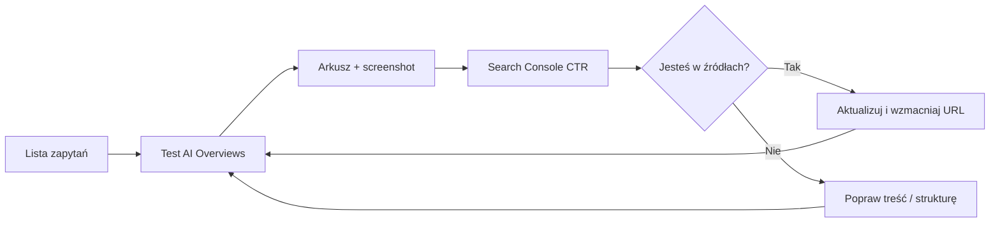

Coraz częściej odpowiedź w Google zaczyna się nie od niebieskiego linku, tylko od **bloku tekstu
wygenerowanego przez AI** — z listą kroków, podsumowaniem i linkami „Źródła” na dole. To **AI Overviews**
(wcześniej znane jako SGE — Search Generative Experience). 🤖

Dla małej firmy pytanie brzmi prosto: **czy w ogóle tam jestem?** A potem: *czy to się zmienia,
czy konkurencja wyparła mnie z podsumowania, czy mój nowy artykuł w końcu trafił do cytowań?*

Monitorowanie AI Overviews nie wygląda jak klasyczny raport z pozycji w TOP 10 — narzędzia dopiero
doganiają rzeczywistość. Da się jednak ułożyć **prosty, powtarzalny system**, który działa bez
budżetu enterprise i bez obsesji na wykresach. Ten wpis pokazuje jak.

Jeśli chcesz najpierw **pisać treści**, które AI chętniej cytuje, zacznij od wpisu o
[treściach pod cytowania w AI](/blog/wpis/tresci-pod-cytowania-ai/). Tu skupiamy się na **obserwacji**
— co Google pokazuje i jak to notować w czasie.

---

## 🧩 Czym są AI Overviews (w dwóch zdaniach)

**AI Overviews** to rozwijane podsumowanie na górze wyników Google dla wielu zapytań informacyjnych
(„jak…”, „co to…”, „ile kosztuje…”, porównania, porady). System składa odpowiedź z wielu stron
i pokazuje **linki do źródeł** — czasem z nazwą domeny, czasem z tytułem artykułu.

To nie zastępuje całkowicie klasycznych wyników — ale **przesuwa kliknięcia**: część użytkowników
kończy na podsumowaniu i nie schodzi niżej. Stąd monitorowanie ma sens nawet przy dobrej pozycji
w „starym” TOP 10.

---

## 📊 Dlaczego warto monitorować (nawet bez idealnych narzędzi)

| Bez monitorowania | Z prostym rytuałem |
|-------------------|-------------------|
| Nie wiesz, czy artykuł w ogóle trafia do AI | Widzisz, które treści „łapią” podsumowanie |
| Konkurencja znika z radaru | Porównujesz, kto jest cytowany przy tych samych frazach |
| Spadek kliknięć wygląda jak „tajemnica SEO” | Możesz połączyć AI Overviews ze spadkiem CTR w Search Console |
| Piszesz w ciemno | Decyzje o tematach oparte na faktach, nie na przeczuciach |

AI Overviews **nie są wszędzie** — Google pokazuje je selektywnie, zależnie od zapytania, kraju,
urządzenia i typu branży. Dlatego monitoring to **próbka + trend**, nie jednorazowy test „wpisałem
frazę i nie ma overview = koniec świata”.

---

## 🎯 Co dokładnie śledzić (4 poziomy)

### 1. Obecność overview (tak / nie)

Czy dla danego zapytania w ogóle pojawia się blok AI na górze?

### 2. Cytowanie Twojej marki (tak / nie / który URL)

Czy w sekcji źródeł widać Twoją domenę, artykuł, wizytówkę?

### 3. Kto jeszcze jest cytowany

Konkurencja, portale branżowe, Wikipedia, fora — kto „zajmuje” sloty źródeł?

### 4. Treść podsumowania vs Twoja oferta

Czy AI opisuje problem **w sposób zgodny** z tym, co sprzedajesz — czy myli kategorie
(np. myli serwis klimatyzacji ze sprzedażą urządzeń)?

Te cztery pola wystarczą do arkusza, który po trzech miesiącach mówi więcej niż jednorazowy audyt. 📋

---

## 📝 Lista zapytań do monitorowania — jak ją zbudować

Nie monitoruj setek fraz. **15–30 zapytań** wystarczy na start — podziel na koszyki:

**A. Brandowe** — nazwa firmy, nazwa + miasto, „[marka] opinie”  
**B. Usługowe / produktowe** — to, za co realnie płacą klienci  
**C. Informacyjne** — pytania z bloga, FAQ, poradniki  
**D. Lokalne** — „[usługa] [miasto]”, „[usługa] near me” (po polsku naturalne warianty)

**Przykłady wielu branż:**

| Branża | Zapytanie do obserwacji |
|--------|-------------------------|
| 🎂 Cukiernia | „tort weselny ile kosztuje”, „[miasto] tort na zamówienie” |
| ❄️ HVAC | „serwis klimatyzacji co ile”, „montaż pompy ciepła koszt” |
| 📺 Sklep RTV | „jaki telewizor 55 cali 2026”, „soundbar czy soundbase” |
| 🏗️ Budowlanka | „remont łazienki ile trwa”, „[miasto] ekipa remontowa opinie” |
| 🦷 Gabinet | „jak często scaling zębów”, „[miasto] dentysta dziecięcy” |

Listę bierz z **Search Console** (zapytania z kliknięciami), z rozmów z klientami i z tematów
wpisów na blogu — nie z generatora „1000 fraz SEO”.

---

## 🔁 Prosty rytuał monitorowania (2× w miesiącu, ~45 min)

### Krok 1: Przygotuj arkusz

Kolumny sugerowane:

- Data  
- Zapytanie  
- AI Overview: tak/nie  
- Cytowanie naszej domeny: tak/nie  
- URL (jeśli tak)  
- Inne źródła (2–3 domeny)  
- Notatka (1 zdanie)

### Krok 2: Sprawdzaj w „czystym” kontekście

- **Tryb incognito** — mniej spersonalizowanych wyników.  
- **To samo urządzenie** co wcześniej (mobile vs desktop — overview bywa różny).  
- **Ta sama lokalizacja** — dla firm lokalnych ustaw region w ustawieniach wyszukiwania Google
  albo testuj z telefonu w obszarze działania (świadomie, wiedząc że wyniki się różnią).

Nie klikać w reklamy, nie scrollować w połowie — najpierw ocena **górnej części** SERP.

### Krok 3: Zrób zrzut ekranu przy cytowaniu

Gdy Twoja strona jest w źródłach — screenshot z datą w nazwie pliku. Przy sporach „czy byliśmy
miesiąc temu” to dowód, nie pamięć. 📸

### Krok 4: Porównaj z Search Console

W raporcie **Wydajność** sprawdź te same frazy: kliknięcia, CTR, pozycja. Spadek CTR przy stabilnej
pozycji czasem koreluje z mocniejszym overview — nie zawsze, ale warto zestawiać. Więcej o raportach:
[5 raportów Search Console co tydzień](/blog/wpis/search-console-5-raportow-tygodniowo/).

### Krok 5: Jedna decyzja po sesji

Np. „Dopisać sekcję FAQ do artykułu X — overview cytuje konkurencję z krótką listą kroków”.

---

## 🛠️ Narzędzia — co działa, a co jeszcze kuleje

**Ręczne wyszukiwanie + arkusz**  
Nadal **najbardziej wiarygodna** metoda dla małej firmy. Zero kosztów, pełna kontrola nad listą fraz.

**Google Search Console**  
Nie pokazuje wprost „byłeś w AI Overview”, ale pokazuje **zapytania, strony, CTR**. Po publikacji
treści pod AI obserwuj, czy rosną wyświetlenia na frazy informacyjne — sygnał pośredni.

**Google Analytics (GA4)**  
Szukaj nowych źródeł ruchu i anomalii w organicu. Bezpośredni referrer z overview bywa trudny
do odseparowania — patrz na **strony docelowe** powiązane z monitorowanymi frazami.

**Narzędzia SEO zewnętrzne** (Semrush, Ahrefs, Surfer i inne — funkcje „AI visibility”)  
Przydają się przy większej skali i wielu frazach. Przy 20 zapytaniach i jednej marce **nie są
obowiązkowe** — często drogie i z opóźnieniem względem tego, co widzisz na żywo w przeglądarce.

**Asystenci AI (ChatGPT, Gemini)**  
Możesz **symulować pytania klientów** i sprawdzać, czy model w ogóle zna markę — to **inny kanał**
niż Google AI Overviews (inne źródła, inna aktualność). Przydatne uzupełnienie, nie substytut.

**Zasada:** jeden główny proces (Google + arkusz) + Search Console. Reszta opcjonalnie, gdy urośnie skala.

---

## 🏭 Co robić, gdy… (scenariusze)

### ✅ Jesteś w źródłach overview

- Sprawdź, **który URL** — strona usługi czy wpis bloga?  
- Utrzymaj treść **aktualną** (daty, ceny orientacyjne, przepisy).  
- Wzmocnij [E-E-A-T](/blog/wpis/budowanie-autorytetu-eeat/) — autor, case, konkret.  
- Nie duplikuj tego samego akapitu na pięciu podstronach — overview i tak wybierze jeden adres.

### ❌ Overview jest, ale Twojej strony tam nie ma

- Przeczytaj podsumowanie: **jakiej formy odpowiedzi** brakuje (lista, definicja, tabela)?  
- Porównaj cytowane strony — często krótsze, bardziej „enciklopedyczne” fragmenty wygrywają.  
- Rozbuduj istniejący artykuł o **cytowalny blok** (reguła + przykład) — technika z wpisu o
  [treściach pod cytowania](/blog/wpis/tresci-pod-cytowania-ai/).  
- Sprawdź, czy strona w ogóle jest zindeksowana ([noindex / canonical](/blog/wpis/indeksacja-noindex-i-canonical/)).

### 🤷 Overview w ogóle nie ma dla ważnej frazy

- Może to zapytanie **transakcyjne** — Google pokazuje mapy, reklamy, sklepy zamiast AI.  
- Dla lokalnej firmy ważniejsze mogą być **Mapy i wizytówka** niż overview — patrz
  [Local SEO 90 dni](/blog/wpis/local-seo-mapy-google/).  
- Notuj „brak overview” — za kwartał sytuacja może się zmienić (Google rozszerza format).

### 😬 Overview cytuje błędne informacje o branży / o Tobie

- Publiczna odpowiedź: **popraw treść u siebie** (jeśli błąd wynika z nieaktualnej strony).  
- Jeśli overview myli fakty na podstawie obcej strony — wzmocnij własne źródło z jednoznaczną
  definicją; zgłoszenia do Google w tej kwestii są ograniczone — **treść + autorytet** to długofalowa naprawa.

---

## 📈 Jak łączyć monitoring z resztą GEO

Monitoring bez działania to Netflix bez popcornu — przyjemne, mało pożytku. 🍿

**Pętla GEO dla małej firmy:**

Co **kwartał** — przegląd listy zapytań: czy nadal odzwierciedlają ofertę? Nowa usługa = nowe frazy
w arkuszu. Szerszy kontekst strategii: [obecność marki w AI i GEO](/blog/wpis/obecnosc-w-ai-geo-sge/).

---

## ⚠️ Pułapki i mity

**„Muszę być w overview przy każdej frazie”**  
Nie. Priorytet to frazy, które **prowadzą do klienta** — nie każda definicja encyklopedyczna.

**„Pozycja #1 gwarantuje cytowanie”**  
Overview wybiera **fragmenty**, nie tylko rank. Bywa, że cytowany jest wynik z #4, bo ma lepszy akapit.

**„Monitoring raz w roku wystarczy”**  
Google i konkurencja aktualizują treści. **Co 2 tygodnie** przy małej liście to rozsądny minimum.

**„Skopiuję odpowiedź overview na stronę”**  
Duplikat obcych sformułowań nic nie daje — własna, precyzyjna odpowiedź z przykładem z branży działa lepiej.

**„AI Overviews = ChatGPT”**  
Inne systemy, inne źródła. Monitoruj Google osobno; asystentów możesz testować dodatkowo.

---

## ✅ Checklist monitorowania AI Overviews

- [ ] 📋 Lista 15–30 zapytań (brand, usługa, info, lokal).
- [ ] 📊 Arkusz z kolumnami: data, fraza, overview, cytowanie, URL, konkurencja.
- [ ] 🔄 Rytm 2× w miesiącu (incognito, spójne urządzenie).
- [ ] 📸 Screenshoty, gdy jesteś w źródłach.
- [ ] 📈 Porównanie z Search Console (CTR, kliknięcia) po każdej sesji.
- [ ] ✍️ Jedna decyzja redakcyjna / techniczna po sesji.
- [ ] 🗓️ Co kwartał — aktualizacja listy fraz i przegląd trendów.

---

## 💡 Podsumowanie

**AI Overviews** zmieniają pierwszy ekran Google — z listy linków w coś bliższego gotowej odpowiedzi
z przypisami. Monitorowanie nie wymaga drogiego stacku: **lista fraz, regularny test, arkusz, Search Console**
i odrobina dyscypliny wystarczą, żeby wiedzieć, czy marka jest w grze, czy tylko patrzy z trybuny.

Nie chodzi o śledzenie każdego algorytmu na świecie — chodzi o to, żeby **nie budować treści w próżni**,
skoro klient coraz częściej dostaje skrót odpowiedzi zanim w ogóle zobaczy Twoją niebieską linkę.
A skoro już monitorujesz — następny krok to jedna poprawka w artykule, który *powinien* być cytowany,
i sprawdzenie za dwa tygodnie, czy Google w końcu doda Twoją domenę do listy źródeł obok Wikipedii
i tego jednego bloga, który aktualizował wpis w 2023 i od tamtej pory tylko zmieniał datę w stopce. 😉
